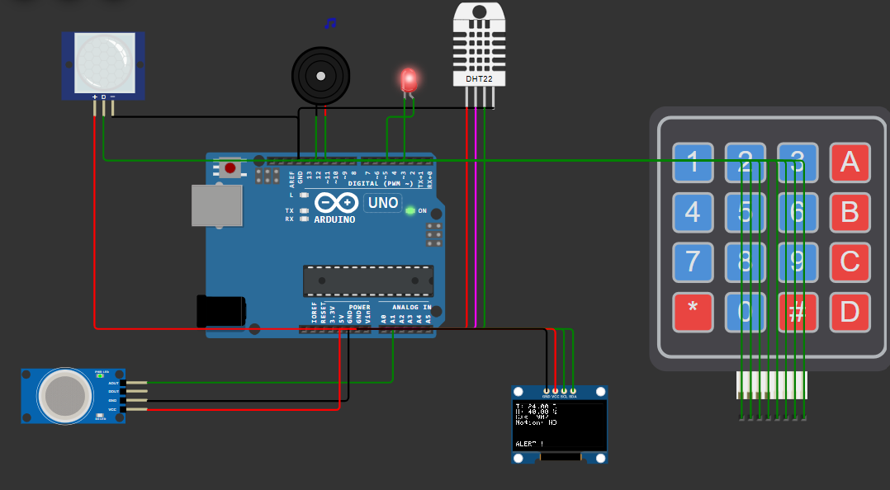

# Smart Car Safety System (Arduino-Based)

An Arduino-powered in-car safety alert system designed to protect children and pets from dangerous environmental conditions. Built as part of the **Disruptive Education Project** by FDE in collaboration with LearnOBots and IST.

## Features
- Mode selection for **Pet**, **Child**, or **Full Monitoring**
- Real-time monitoring of:
  - **Temperature & Humidity** (via DHT11)
  - **Gas levels** (via MQ2)
  - **Motion detection** (via PIR sensor)
- Visual alerts on **OLED display**
- Audible/visual alert using **buzzer & LED**
- Manual alert override using **keypad**
- Safe state reset using a **physical button or keypad key**

---

## Hardware Components
| Component        | Quantity | Purpose                    |
|------------------|----------|----------------------------|
| Arduino Uno      | 1        | Main controller            |
| DHT11 Sensor     | 1        | Temperature & Humidity     |
| MQ2 Gas Sensor   | 1        | Gas/Smoke detection        |
| PIR Sensor       | 1        | Motion detection           |
| OLED Display (0.96") | 1    | Displaying environment data|
| Buzzer           | 1        | Audible alarm              |
| Red LED          | 1        | Visual alarm               |
| 4x4 Keypad       | 1        | Mode and alert control     |
| Push Button      | 1        | Reset                      |
| Breadboard + Wires | 1 set  | Connections                |

---

## Pin Connections

| Arduino Pin | Component        | Notes                    |
|-------------|------------------|--------------------------|
| A0          | DHT11            | Temperature sensor       |
| A1          | MQ2 Gas Sensor   | Analog input             |
| 2           | PIR Sensor       | Digital input            |
| 3           | Buzzer           | Output                   |
| 4           | Red LED          | Output                   |
| 5           | Push Button      | Input (active LOW)       |
| 6–9         | Keypad Rows      |                          |
| 10–13       | Keypad Columns   |                          |
| I2C (A4, A5)| OLED Display     | SDA (A4), SCL (A5)        |

---

## Required Libraries

Install these via Arduino Library Manager:

- `Adafruit_SSD1306`
- `Adafruit_GFX`
- `DHT sensor library`
- `Keypad`

---

## Project Logic Summary

- Press **A/B/C** to set mode.
- Sensors monitor real-time conditions.
- If critical levels are detected:
  - **LED and Buzzer** blink as alerts.
  - **OLED** displays “ALERT!!”
- Press **D** for manual alert.
- Press **#** or use button to reset to safe state.

---

## Demo

---

## Contribution & Feedback

If you have suggestions to improve or expand this project (e.g., GSM alerts, solar, mobile app), feel free to open an issue or connect on LinkedIn.
